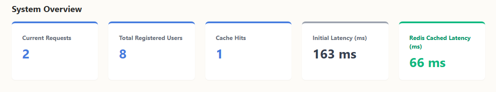
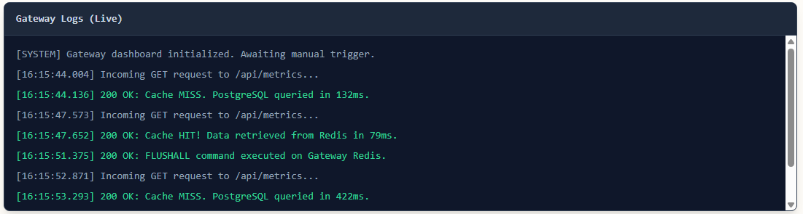

# Latency-Optimized API Proxy

A high-performance, cloud-native API gateway and reverse proxy built with TypeScript and Express. It sits at the edge of the network to intercept client traffic, serving cached responses directly from memory via Redis, achieving up to a **~60%** reduction in network latency.



---

### Live Proxy Routing

Once the server is running, the gateway intercepts requests and dynamically manages cached telemetry. The logs below demonstrate the complete caching lifecycle: an initial cache miss querying PostgreSQL (132ms), a subsequent high-speed cache hit from Redis (79ms), and the system correctly reverting to a database query (422ms) immediately after a cache flush.



---

### Prerequisites
Make sure you have Node.js and npm installed. You will also need a local Redis instance and  ensure the frontend and Backend services are running locally on your machine.

## Getting Started

### Installation

1. Clone the repository:
   ```bash
   git clone https://github.com/SaharshBhatnagar/Latency-Optimized-API-Proxy-gateway.git
   ```


2. Navigate to the project directory:

    ```Bash
    cd Latency-Optimized-API-Proxy-gateway
    ```

3. Install dependencies:

    ```Bash
    npm install
    ```

4. Create your environment file:

    Create a .env file in the root and add your `PORT`, `REDIS_URL` and `JWT_SECRET`

    > **Note:** In a production AWS environment, the `REDIS_URL` should point to your ElastiCache Primary Endpoint.
    

5. Start the development server:

    ```Bash
    npm run dev
    ```

## Usage

### Production Build

1. Compile the TypeScript Code:

    ```Bash
    npm run build
    ```

2. Start the Compiled Server:

    ```Bash
    npm start
    ```

### Docker Deployment

The proxy can be run as a container by mapping the ports and providing an environment variable file:

```Bash
docker build -t latency-optimized-api-proxy-gateway .
docker run -p 8000:8000 --env-file .env latency-optimized-api-proxy-gateway
```

If you need to connect the Docker container to a local backend network, run it via docker-compose:

```Bash
docker compose up -d gateway
```

## Directory Structure

```Latency-Optimized-API-Proxy/
├── .github/workflows/deploy.yml
├── src/
│   ├── config/              
│   │   ├── gateway.json     
│   │   └── redisClient.ts   
│   ├── middlewares/         
│   │   ├── auth.ts          
│   │   ├── cache.ts         
│   │   └── rateLimiter.ts   
│   ├── routes/
│   │   └── proxy.ts         
│   └── server.ts           
├── Dockerfile             
├── package.json             
└── tsconfig.json           
```


## CI/CD Pipeline

> This repository includes a GitHub Actions workflow (`deploy.yml`) that automatically builds the Docker image and pushes it to Amazon Elastic Container Registry (ECR) upon pushes to the main branch. Ensure your AWS IAM credentials (`AWS_ACCESS_KEY_ID` and `AWS_SECRET_ACCESS_KEY`) are stored safely in GitHub Repository Secrets.


## Additional Documentation

**Users**
> The Redis client utilizes a singleton pattern with a 4-minute pingInterval to prevent AWS VPC silent idle connection drops.

**Tech Stack:** TypeScript, Redis, AWS (ECR, EC2, RDS, Elasticache), Docker, Node.js, Express

**Included packages:** cors, helmet, http-proxy-middleware, jsonwebtoken, and redis.

---

## Full Architecture Stack

This gateway proxy is one component of a complete cloud-native ecosystem. You can explore the other microservices in this architecture here:

* **Frontend:** [Dashboard Repository](https://github.com/SaharshBhatnagar/Latency-optimized-API-Proxy-frontend)

* **Backend:** [Latency Optimized API Proxy Backend](https://github.com/SaharshBhatnagar/Latency-optimized-API-Proxy-backend)

